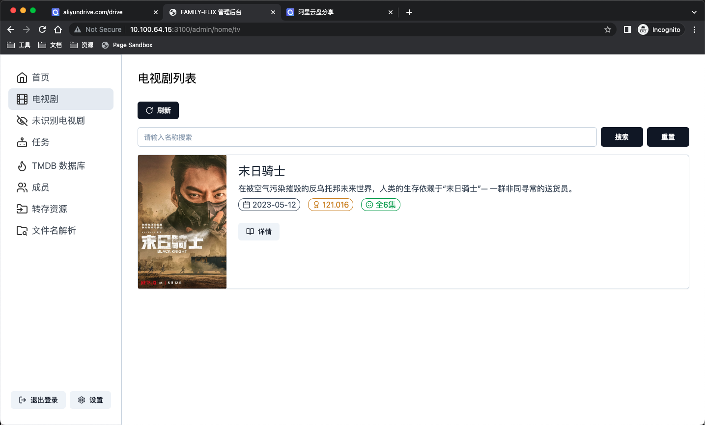
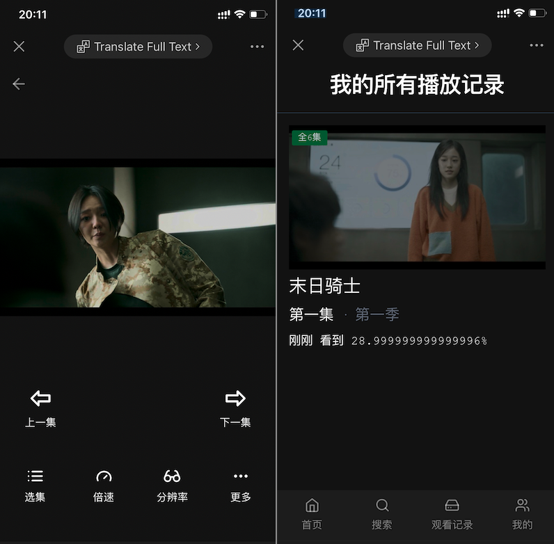

# 飞乐

类似 `Alist`，但专注影视剧观看、更新。

## 功能

1. 索引云盘文件并通过海报墙展示云盘内影视文件
2. 在线观看云盘视频、记录观看历史
3. 家庭成员可直接通过授权链接访问，无需登录
4. 自动追踪影视剧更新并同步至云盘

## 使用前须知

该项目**「不提供影视剧资源」**，它的核心功能是根据云盘内的影视剧文件名字在 `TMDB` 上搜索对应影视剧的海报、描述等信息。使用该项目前，你必须有

1. 存储了影视剧文件的云盘（目前仅支持阿里云盘）
2. 能够抓包查看网络请求、安装了阿里云盘的手机
3. 下面两个二选一
   - 3.1 要求外网可以访问，需要一台可以公网访问的服务器（性能要求低，视频播放直接走阿里云盘不占服务器流量）
   - 3.2 只在局域网内使用，一台电脑即可

满足条件后，可看该文档[安装、运行](https://www.yuque.com/u7327/lm76f6)

## Docker 部署

```bash
docker build -t flix .
```

端口为 8000，数据库等文件夹路径为 `/output`

```bash
docker run -d -v /local/output:/output -p 8000:8000 -n flix.prod flix
```

## 运行

`clone` 项目后安装依赖，执行 `node scripts/ncc.js`。然后 `yarn dev` 就可以了。

## 单元测试

先生成 `db` 文件

```bash
DATABASE_PATH=file://$PWD/domains/__tests__/output/data/family-flix.db yarn prisma db push
```

## 效果预览

### 管理后台



### 视频播放移动端



### 视频播放 PC 端


## API 文档

1. [管理后台 API](https://documenter.getpostman.com/view/7312751/2s93sXdEzv)
2. [视频播放 API](https://documenter.getpostman.com/view/7312751/2s93sXdF5R)

## 前端项目

1. [视频播放移动端](https://github.com/family-flix/mobile1)
2. [视频播放 PC 端](https://github.com/family-flix/pc2)
3. [管理后台](https://github.com/family-flix/admin1)
