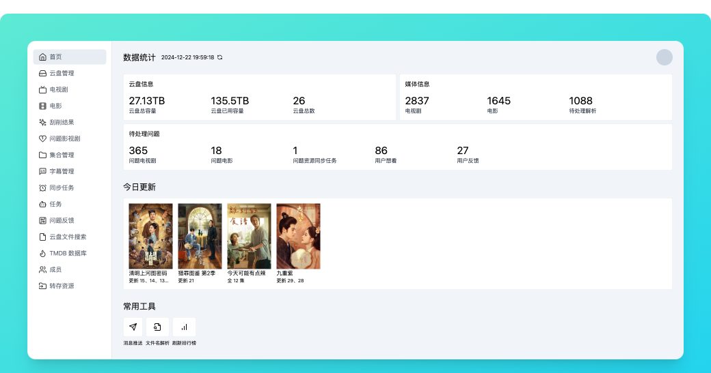

<!-- Improved compatibility of back to top link: See: https://github.com/othneildrew/Best-README-Template/pull/73 -->

<a name="readme-top"></a>

<!-- PROJECT SHIELDS -->
<!--
*** I'm using markdown "reference style" links for readability.
*** Reference links are enclosed in brackets [ ] instead of parentheses ( ).
*** See the bottom of this document for the declaration of the reference variables
*** for contributors-url, forks-url, etc. This is an optional, concise syntax you may use.
*** https://www.markdownguide.org/basic-syntax/#reference-style-links
-->

<!-- PROJECT LOGO -->
<br />
<div align="center">
  <a href="https://family-flix.github.io/docs/">
    
  </a>

  <h3 align="center">FamilyFlix</h3>

  <p align="center">
    视频刮削 + 云盘管理 + 自动更新 + 在线观看
    <br />
    <a href="https://family-flix.github.io/docs/"><strong>Explore the docs »</strong></a>
    <br />
    <br />
    <!-- <a href="https://github.com/othneildrew/Best-README-Template">View Demo</a> -->
    <!-- · -->
    <a href="https://github.com/family-flix/api/issues">Report Bug</a>
    ·
    <a href="https://github.com/family-flix/api/issues">Request Feature</a>
  </p>
</div>

<!-- TABLE OF CONTENTS -->
<!-- <details>
  <summary>Table of Contents</summary>
  <ol>
    <li>
      <a href="#about-the-project">About The Project</a>
      <ul>
        <li><a href="#built-with">Built With</a></li>
      </ul>
    </li>
    <li>
      <a href="#getting-started">Getting Started</a>
      <ul>
        <li><a href="#prerequisites">Prerequisites</a></li>
        <li><a href="#installation">Installation</a></li>
      </ul>
    </li>
    <li><a href="#usage">Usage</a></li>
    <li><a href="#roadmap">Roadmap</a></li>
    <li><a href="#contributing">Contributing</a></li>
    <li><a href="#license">License</a></li>
    <li><a href="#contact">Contact</a></li>
    <li><a href="#acknowledgments">Acknowledgments</a></li>
  </ol>
</details> -->

<!-- ABOUT THE PROJECT -->

## ✨ 功能

- 🌈 索引云盘文件刮削影视剧信息
- 🚀 追踪影视剧更新，自动同步新增内容到云盘
- 📦 微信、桌面浏览器、小程序在线观看影视剧，记录观看历史

## ⭐️ 概览

云盘看视频最简单的方案。应用维护方管理云盘和视频；视频观看方在微信里点开链接直接观看，无需下载安装 App、没有广告。



<!-- [![管理后台首页][assets/admin-home.png]](https://docs.family-flix.github.com)
[![移动端1][assets/mobile-example1.png]](https://docs.family-flix.github.com)
[![移动端2][assets/mobile-example2.png]](https://docs.family-flix.github.com) -->


<p align="right">(<a href="#readme-top">back to top</a>)</p>

## 👀 使用前须知

该项目**「不提供影视剧资源」**，使用该项目前，你必须有「存储了影视剧文件的云盘（目前仅支持阿里云盘）」


## 🖥️ 部署

### docker 部署

```bash
# Windows
docker run -d -v ${PWD}:/output -p 3000:8000 --name flix ltaoo/family_flix:2.5.0
# linux
docker run -d -v $(pwd):/output -p 3000:8000 --name flix ltaoo/family_flix:2.5.0
```

第一次启动必然会因为栈溢出失败，当容器终止后，重新启动容器即可。

```bash
docker start flix
```

然后查看容器内终端输出，会显示管理员账户与密码

```bash
docker logs flix
# 管理员
# 帐号 admin@flix.com
# 密码 <六位字母+数字>
```

然后就可以访问管理后台进行操作了
<br/>
管理后台地址 http://127.0.0.1:3000/admin/home/index

> 如果忘记或没看到密码，可以通过终端修改密码

```bash
docker exec flix node /app/pwd.js new_pwd
```

### 源码部署

> 要求 `NodeJs` 版本大于 `18`。

从 [Release](https://github.com/family-flix/api/releases) 下载 `family_flix_xxx.zip` 名字的压缩包,并解压至本地。

1. 安装依赖并初始化数据库

```bash
yarn
yarn prisma migrate deploy --schema ./prisma/schema.prisma
```

2. 数据库初始化完成后执行 `yarn start` 即可启动项目。

```bash
# 运行
yarn start
```

同样首次启动会创建管理员账号，请注意终端信息。之后启动将不再展示管理员账号密码，如遗忘密码则只能修改密码。

访问地址同上

添加云盘、刮削等操作可以参考文档。<a href="https://family-flix.github.io/docs/"><strong>Explore the docs »</strong></a>

<!--
### 更新

只需要拉取新代码，再执行一次安装依赖、应用数据库变更、打包即可。

```bash
# 拉取新代码
git pull origin main
# 安装依赖
yarn
# 应用数据库变更
yarn prisma migrate deploy --schema ./prisma/schema.prisma
# 打包
yarn build
# 运行
yarn start
``` -->

## 开发

### 打包镜像

可以参考该 `action` https://github.com/family-flix/release/blob/main/.github/workflows/ci.yaml

## API 文档

- [管理后台 API](https://documenter.getpostman.com/view/7312751/2s93sXdEzv)
- [视频播放 API](https://documenter.getpostman.com/view/7312751/2s93sXdF5R)

## 跨平台打包

```bash
# Linux amd64
CGO_ENABLED=1 GOOS=linux GOARCH=amd64 go build -o flixapi ./main.go

# Linux arm64
CGO_ENABLED=0 GOOS=linux GOARCH=arm64 go build -o flixapi ./cmd/server

# macOS amd64 (Intel)
CGO_ENABLED=0 GOOS=darwin GOARCH=amd64 go build -o flixapi-darwin-amd64 ./cmd/server

# macOS arm64 (Apple Silicon)
CGO_ENABLED=0 GOOS=darwin GOARCH=arm64 go build -o flixapi-darwin-arm64 ./cmd/server

# Windows amd64
CGO_ENABLED=0 GOOS=windows GOARCH=amd64 go build -o flixapi-windows-amd64.exe ./cmd/server
```

## 相关项目

- [视频播放移动端](https://github.com/family-flix/mobile1)
- [视频播放小程序](https://github.com/family-flix/weapp)
- [视频播放桌面端](https://github.com/family-flix/pc2)
- [管理后台](https://github.com/family-flix/admin1)
